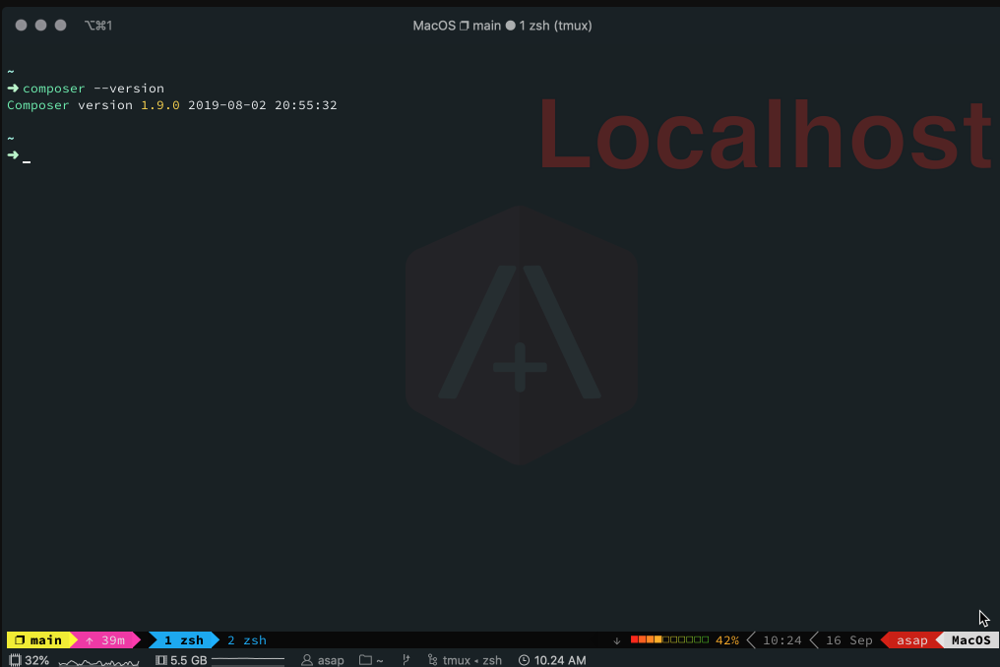

# Composer is a cross-platform dependency manager for PHP libraries.

> In this guide, i'm installing Composer on a machine running Mac OS

1. Open a terminal and navigate to your user directory, ie cd /User/`<USER_NAME>`/Downloads/
2. Run this command shown below to download Composer. This will create a Phar (PHP Archive) file called `composer.phar`:

``` bash
curl -sS https://getcomposer.org/installer | php
```

3. Now we move `composer.phar` file to a directory

``` bash
sudo mv composer.phar /usr/local/bin/
```

4. We want to run Composer with having to be root al the time, so we need to change the permissions:

``` bash
sudo chmod 755 /usr/local/bin/composer.phar
```

5. Next, we need to let Bash know where to execute Composer:

``` bash
vim ~/.bashrc
```

or

``` bash
vim ~/.zshrc
```

Add this line below to bash_profile and save

``` bash
alias composer="php /usr/local/bin/composer.phar"
```

and then run this command:

``` bash
source ~/.bashrc
```

or

``` bash
source ~/.zshrc
```

6. Finally, run:

``` bash
composer --version
```

If all goes well and it is working, you'll see this screen:


