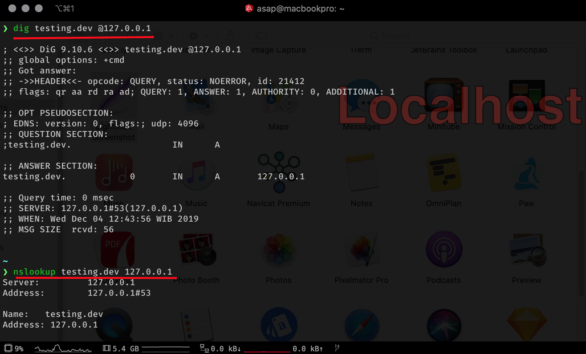
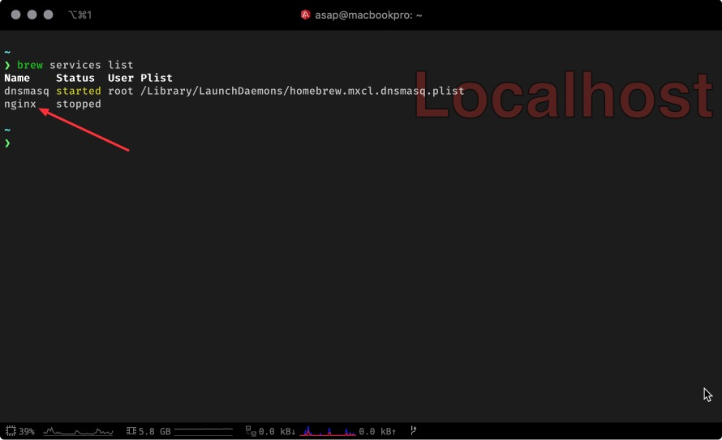

# Install Nginx, Dnsmasq, PHP (Default from OS) and Mysql on macOS Catalina

## 1. Homebrew

Prerequisites

-   **You should have some familiarity with the Mac Terminal application** since you’ll need to use it to install Homebrew. The Terminal application is located in the Utilities folder in the Applications folder.

-   **Dependencies**. You need to install one other piece of software before you can install Homebew:
    Xcode. Install Apple’s Xcode development software: [Xcode in the Apple App Store](http://itunes.apple.com/us/app/xcode/id497799835?ls=1&mt=12).

**Install Homebrew**

```bash
/usr/bin/ruby -e "$(curl -fsSL https://raw.githubusercontent.com/Homebrew/install/master/install)"
```

## 2. DnsMasq

Dnsmasq provides network infrastructure for small networks: DNS, DHCP, router advertisement and network boot.

Install from brew

> `brew install dnsmasq`

check dnsmasq installation service

> `brew services list`

Edit dnsmasq configuration, and add a line at the end of the file

`sudo vim /usr/local/etc/dnsmasq.conf`

add code:

```bash
# This file will be added to the configuration
conf-file=/Users/your_user_name/.config/dnsmasq/dnsmasq.conf
```

**Create a new configuration file for wildcard**
We create a new configuration file to manage `*.dev` and `*.test` domains.

`sudo vim /Users/your_user_name/.config/dnsmasq/dnsmasq.conf`

```bash
# example.localhost will be resolved as 127.0.0.1, including subdomains
address=/dev/test/127.0.0.1
listen-address=127.0.0.1
```

for \*.dev (example: testing.dev)

create file `/etc/resolver/dev`

`sudo vim /etc/resolver/dev`

```bash
nameserver 127.0.0.1
```

for \*.test (example: testing.test)

create file `/etc/resolver/test`

`sudo vim /etc/resolver/test`

```bash
nameserver 127.0.0.1
```

**Restart dnsmasq**
you can do this script on terminal.

```bash
sudo brew services stop dnsmasq
sudo brew services start dnsmasq
```

you can testing wildcard domain after all do on above

-   cod: `dig testing.dev @127.0.0.1` or `nslookup testing.dev 127.0.0.1`

-   cod: `dig testing.test @127.0.0.1` or `nslookup testing.test 127.0.0.1`



## 3. Nginx

Install Nginx application from homebrew as service.

-   First check Nginx version on brew: `brew info nginx`

-   Then install nginx: `brew install nginx`

> you can check installation on system with `brew services list`



for handling brew service:

-   start: `brew services start nginx`

-   stop: `brew services stop nginx`

-   restart: `brew services restart nginx`

> Before you can use PHP Default form OS Catalina, do the following steps.

```bash
sudo cp /private/etc/php-fpm.conf.default /private/etc/php-fpm.conf
```

_edit php-fpm.conf_:

> create first directory for error log: `sudo mkdir /var/log/php` + `sudo chgrp -R staff /var/log/php` + `sudo chmod -R ug+w /var/log/php`

```bash
error_log=/var/log/php/php-fpm.log
```

```bash
sudo cp /private/etc/php.ini.default /private/etc/php.ini.conf
```

```bash
sudo cp /private/etc/php-fpm.d/www.conf.default /private/etc/php-fpm.d/www.conf
```

> check config php-fpm: `sudo php-fpm -D`

### Setup nginx config

```bash

#user nobody;
worker_processes  1;

#error_log  logs/error.log;
#error_log  logs/error.log  notice;
#error_log  logs/error.log  info;

#pid        logs/nginx.pid;


events {
    worker_connections  1024;
}


http {
    include       mime.types;
    default_type  application/octet-stream;

    #log_format  main  '$remote_addr - $remote_user [$time_local] "$request" '
    #                  '$status $body_bytes_sent "$http_referer" '
    #                  '"$http_user_agent" "$http_x_forwarded_for"';

    #access_log  logs/access.log  main;

    sendfile        on;
    #tcp_nopush     on;

    #keepalive_timeout  0;
    keepalive_timeout  65;

    gzip  on;

    server {
        listen       80;
        server_name  localhost.dev;

        #charset koi8-r;

        #access_log  logs/host.access.log  main;

        location / {
            root   html;
            index  index.html index.htm;
        }

        #error_page  404              /404.html;

        # redirect server error pages to the static page /50x.html
        #
        error_page   500 502 503 504  /50x.html;
        location = /50x.html {
            root   html;
        }

        # proxy the PHP scripts to Apache listening on 127.0.0.1:80
        #
        #location ~ \.php$ {
        #    proxy_pass   http://127.0.0.1;
        #}

        # pass the PHP scripts to FastCGI server listening on 127.0.0.1:9000
        #
        #location ~ \.php$ {
        #    root           html;
        #    fastcgi_pass   127.0.0.1:9000;
        #    fastcgi_index  index.php;
        #    fastcgi_param  SCRIPT_FILENAME  /scripts$fastcgi_script_name;
        #    include        fastcgi_params;
        #}

        # deny access to .htaccess files, if Apache's document root
        # concurs with nginx's one
        #
        #location ~ /\.ht {
        #    deny  all;
        #}
    }


    # another virtual host using mix of IP-, name-, and port-based configuration
    #
    #server {
    #    listen       8000;
    #    listen       somename:8080;
    #    server_name  somename  alias  another.alias;

    #    location / {
    #        root   html;
    #        index  index.html index.htm;
    #    }
    #}


    # HTTPS server
    #
    #server {
    #    listen       443 ssl;
    #    server_name  localhost;

    #    ssl_certificate      cert.pem;
    #    ssl_certificate_key  cert.key;

    #    ssl_session_cache    shared:SSL:1m;
    #    ssl_session_timeout  5m;

    #    ssl_ciphers  HIGH:!aNULL:!MD5;
    #    ssl_prefer_server_ciphers  on;

    #    location / {
    #        root   html;
    #        index  index.html index.htm;
    #    }
    #}
    include /Users/your_user_name/.config/nginx/*;
}
```

> setup directory for nginx logging: `sudo mkdir -p /var/log/nginx` + `sudo chgrp -R staff /var/log/nginx` + `sudo chmod -R ug+w /var/log/nginx`
> to setup a virtual host I add the config code and for the virtual host config I put it in the HOME directory.
> for example: `/Users/your_user_name/.config/nginx`

`include /Users/your_user_name/.config/nginx/*;`

Create nginx integrate with `PHP` from `factcgi` config.

> create file conf on `/usr/local/etc/nginx/php-cgi.conf`

`sudo vim /usr/local/etc/nginx/php-cgi.conf`

```bash
location ~ [^/]\.php(/|$) {
    fastcgi_split_path_info ^(.+?\.php)(/.*)$;
    if (!-f $document_root$fastcgi_script_name) {
        return 404;
    }

    # Mitigate https://httpoxy.org/ vulnerabilities
    fastcgi_param HTTP_PROXY "";

    fastcgi_pass 127.0.0.1:9000;
    fastcgi_index index.php;

    # include the fastcgi_param setting
    include fastcgi_params;

    # SCRIPT_FILENAME parameter is used for PHP FPM determining
    #  the script name. If it is not set in fastcgi_params file,
    # i.e. /etc/nginx/fastcgi_params or in the parent contexts,
    # please comment off following line:
    fastcgi_param  SCRIPT_FILENAME   $document_root$fastcgi_script_name;
}
```

now you can check if config runnig corectly, `include php-cgi.conf` to virtual host config.

1. create PHP file about information on PHP environment such as modules & extentions.

    _you can place this file up to you. for example_ (`/Users/your_user_name/Projects/php/test/index.php`)

    ```bash
    <?php

    phpinfo()
    ```

2. create virtual host for this project.

    remember if we must create this file on `/Users/your_user_name/.config/nginx/`

    so create file `testing` without extention: `/Users/your_user_name/.config/nginx/testing`

    ```bash
    server {
        listen        80;

        server_name   phpinfo.dev;

        error_log     /var/log/nginx/error.log;
        root          /Users/your_user_name/Projects/php/test;

        location / {
            index  index.html index.htm index.php;
        }

        include php-cgi.conf;

        location ~ /\.ht {
            deny all;
        }
    }
    ```

for make sure your nginx config at virtual host remember to check first before reload nginx config.

`nginx -t`

if no error then reload config

`nginx -s reload`

now you can check on browser call url: `http://phpinfo.dev`

> continue for setup `MySQL`

asapdotid@2019

if you have questions or issues please contact me twitter @asapdotid or you we can discuss on [Nginx Indonesia's Telegram channel](https://t.me/id_nginx)
